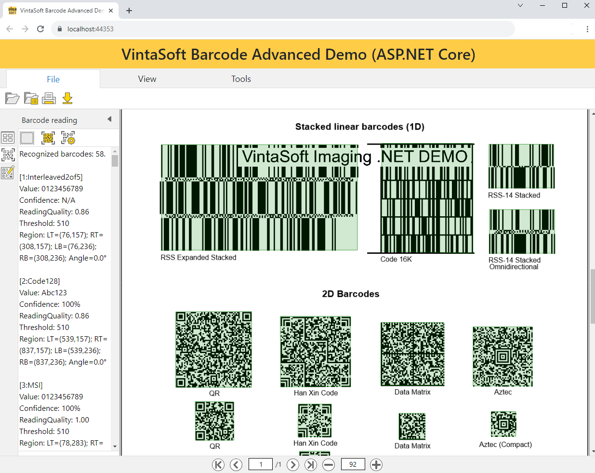
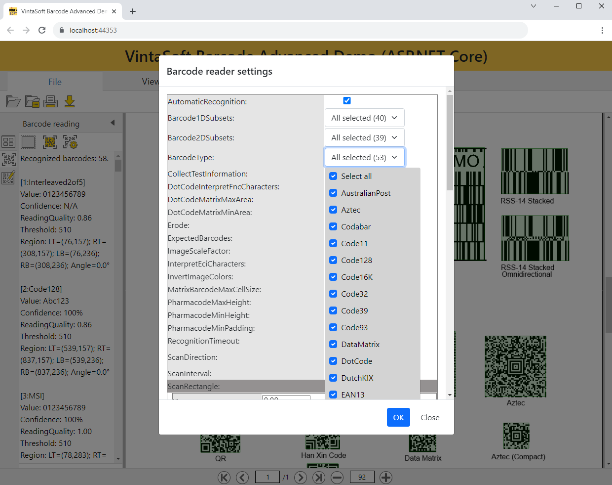
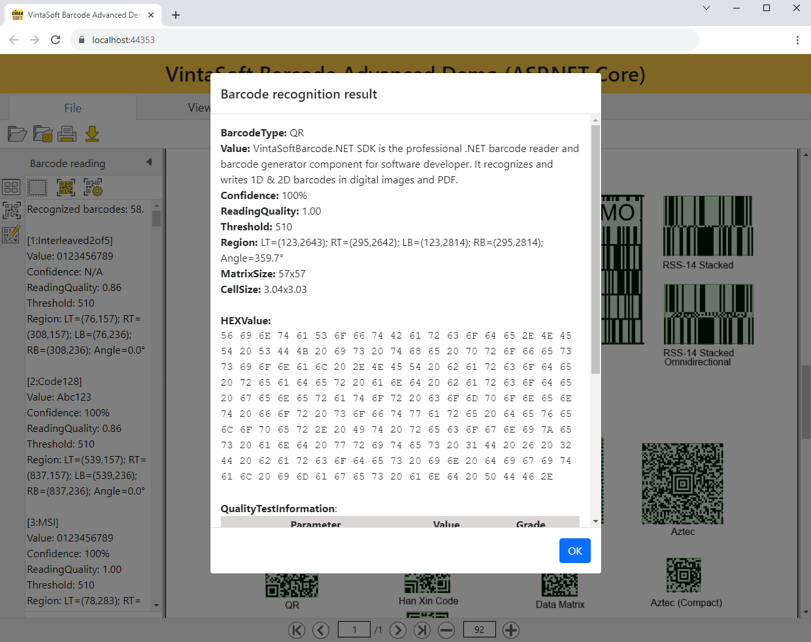
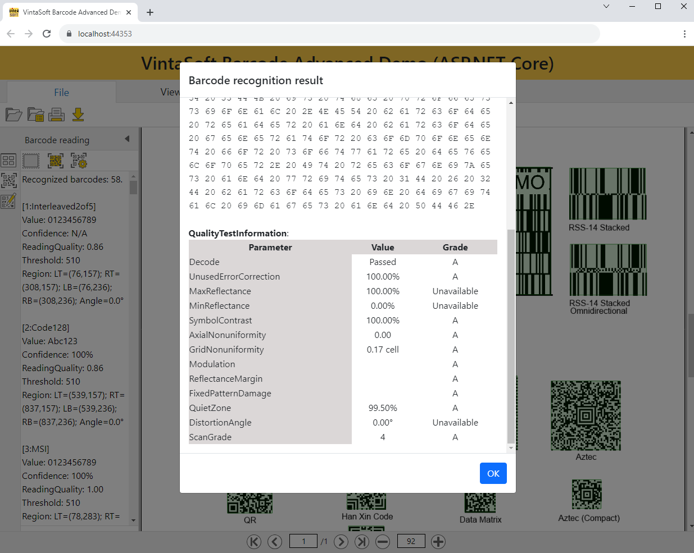
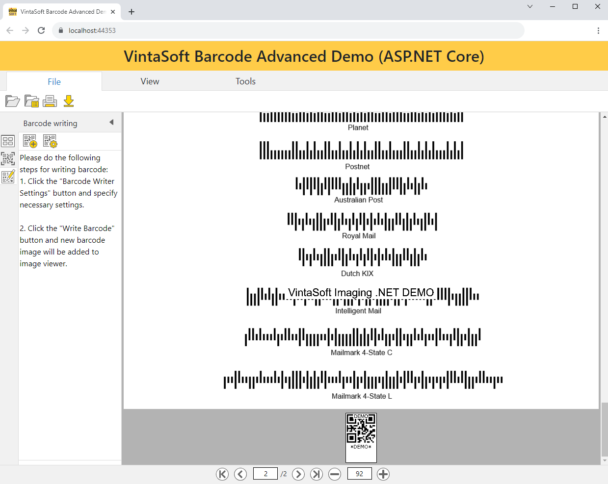
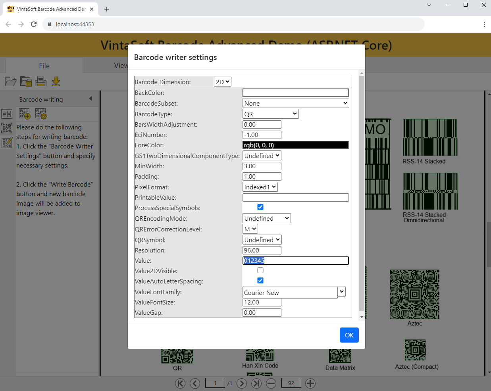

# VintaSoft ASP.NET Core Barcode Advanced Demo

This ASP.NET Core project uses <a href="https://www.vintasoft.com/vsimaging-dotnet-index.html">VintaSoft Imaging .NET SDK</a> and <a href="https://www.vintasoft.com/vsbarcode-dotnet-index.html">VintaSoft Barcode .NET SDK</a>.
The client-side of project uses HTML+JavaScript+CSS. The server-side of project uses ASP.NET Core API controllers.<br />
<br />
The project demonstrates how to recognize and generate barcodes in ASP.NET Core:
* Open image with barcodes.
* View image with barcodes.
* Specify settings of barcode reader.
* Recognize linear, postal and 2D barcodes in image.
* Verify print quality of 1D linear barcode image using ISO/IEC 15416 barcode print quality test.
* Verify print quality of 2D matrix barcode image using ISO/IEC 15415 barcode print quality test.
* Verify print quality of 2D multi-row barcode image using ISO/IEC 15415 barcode print quality test.
* Specify settings of barcode writer.
* Generate image of linear, postal or 2D barcode.
* The application can be used in any modern HTML5 web browser.
* Supported linear barcodes (1D): Code 11; Code 39; Code 39 Extended; Code 32; Code 39 without Start/Stop symbols; VIN; PZN; DHL AWB; Numly Number; HIBC LIC 39; Code 93; Codabar; Code 128; GS1-128; SSCC-18; FedEx Ground96; VICS BOL, VICS SCAC PRO; Swiss PostParcel; ISBT 128; HIBC LIC 128; EAN-8, EAN-8 +2, EAN-8 +5, JAN-8, EAN-Velocity; EAN-13, EAN-13 +2, EAN-13 +5, JAN-13, ISBN, ISSN, ISMN; UPC-A, UPC-A +2, UPC-A +5; UPC-E, UPC-E +2, UPC-E +5; Standard 2 of 5; Interleaved 2 of 5; ITF-14; OPC; Deutsche Post Identcode; Deutsche Post Leitcode; IATA 2 of 5; Matrix 2 of 5; Telepen; Patch Code; RSS-14, GS1 DataBar; RSS Limited, GS1 DataBar Limited; RSS Expanded, GS1 DataBar Expanded; Pharmacode; MSI
* Supported stacked linear barcodes (1D): Code 16K; RSS-14 Stacked, GS1 DataBar Stacked; RSS Expanded Stacked, GS1 DataBar Expanded Stacked
* Supported postal 2/4-state barcodes (1D): Australian Post; Dutch KIX; Royal Mail; Postnet; Planet; Intelligent Mail; Mailmark 4-state barcode C; Mailmark 4-state barcode L
* Supported 2D barcodes: Aztec, Aztec Compact, Aztec Rune; GS1 Aztec; XFA Compressed Aztec; HIBC LIC Aztec Code; Data Matrix; GS1 Data Matrix; PPN; Royal Mail Mailmark CMDM Type7, Type9, Type29; XFA Compressed DataMatrix; ISBT 128 Data Matrix; HIBC LIC Data Matrix; DotCode; GS1 DotCode; Han Xin Code; PDF417, PDF417 Compact, Macro PDF417; AAMVA; XFA Compressed PDF417; Micro PDF417; QR Code; GS1 QR Code; XFA Compressed QR Code; HIBC LIC QR Code; Swiss QR Code; Micro QR Code; MaxiCode
* Supported composite barcodes: GS1-128 CC-A, GS1-128 CC-B, GS1-128 CC-C; GS1 DataBar CC-A, GS1 DataBarCC-B; GS1 DataBar Expanded CC-A, GS1 DataBar Expanded CC-B; GS1 DataBar Expanded Stacked CC-A, GS1 DataBar Expanded Stacked CC-B; GS1 DataBar Limited CC-A, GS1 DataBar Limited CC-B; GS1 DataBar Stacked CC-A, GS1 DataBar Stacked CC-B; EAN-13 CC-A, EAN-13 CC-B; EAN-8 CC-A, EAN-8 CC-B; UPC-A CC-A, UPC-A CC-B; UPC-E CC-A, UPC-E CC-B


## Screenshot
<br />
<br />
<br />
<br />
<br />
<br />


## Usage
1. Get the 30 day free evaluation license for <a href="https://www.vintasoft.com/vsimaging-dotnet-index.html" target="_blank">VintaSoft Imaging .NET SDK</a> as described here: <a href="https://www.vintasoft.com/docs/vsimaging-dotnet/Licensing-Evaluation.html" target="_blank">https://www.vintasoft.com/docs/vsimaging-dotnet/Licensing-Evaluation.html</a>

2. Update the evaluation license in "src\Startup.cs" file:
   ```
   Vintasoft.Imaging.ImagingGlobalSettings.Register("REG_USER", "REG_EMAIL", "EXPIRATION_DATE", "REG_CODE");
   ```

3. Build the project ("AspNetCoreBarcodeAdvancedDemo.Net7.csproj" file) in Visual Studio or using .NET CLI:
   ```
   dotnet build AspNetCoreBarcodeAdvancedDemo.Net7.csproj
   ```

4. Run compiled application and try to recognize and generate barcodes.


## Documentation
VintaSoft Imaging .NET SDK on-line User Guide and API Reference for .NET developer is available here: https://www.vintasoft.com/docs/vsimaging-dotnet/


## Support
Please visit our <a href="https://myaccount.vintasoft.com/">online support center</a> if you have any question or problem.
